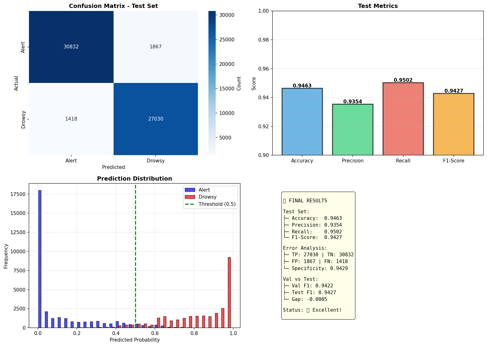

# 🧠 Drowsiness Detection Model - BiLSTM with Attention

نموذج كشف النعاس باستخدام BiLSTM مع Multi-Head Attention

## 🎯 النتائج النهائية



### الأداء

- **Accuracy:** 94.63%
- **Precision:** 93.54%
- **Recall:** 95.02%
- **F1-Score:** 94.27%
- **Specificity:** 94.29%

### تحليل الأخطاء

- True Positives (كشف صحيح للنعاس): 27,030
- True Negatives (كشف صحيح للاستيقاظ): 30,832
- False Positives (إنذارات كاذبة): 1,867
- False Negatives (حالات فاتة): 1,418

## 🏗️ معمارية النموذج
```
Input (Sequence: 15 frames, 22 features)
    ↓
BiLSTM (128 hidden units, 3 layers, bidirectional)
    ↓
Multi-Head Attention (4 heads)
    ↓
Dense Layers (256 → 128 → 64 → 32 → 1)
    ↓
Sigmoid
    ↓
Output (Alert or Drowsy)
```

## 🚀 الاستخدام
```python
from inference import DrowsinessDetector
import numpy as np

# حمّل النموذج
detector = DrowsinessDetector()

# بيانات عينة (15, 22)
features = np.random.randn(15, 22)

# التنبؤ
result = detector.predict(features)
print(result['prediction'])  # Alert أو Drowsy
print(result['probability']) # 0.0-1.0
```

## 📋 المتطلبات
```bash
pip install -r requirements.txt
```

## 📁 الملفات

- `drowsiness_detector_final.pth` - النموذج المدرب
- `drowsiness_detector_info.json` - معلومات النموذج
- `feature_scaler.pkl` - Scaler البيانات
- `inference.py` - مثال الاستخدام
- `requirements.txt` - المكتبات المطلوبة
- `README.md` - هذا الملف

## 🔬 البيانات والميزات

**عدد الميزات:** 22 feature
- Eye features (EAR, ...)
- Mouth features (MAR, ...)
- Gaze features (X, Y angles)
- Head pose (Rx, Ry, Rz)
- وميزات وجهية أخرى

**طول التسلسل:** 15 frames

## ✅ الحالة

✅ النموذج جاهز للاستخدام في الإنتاج

---
